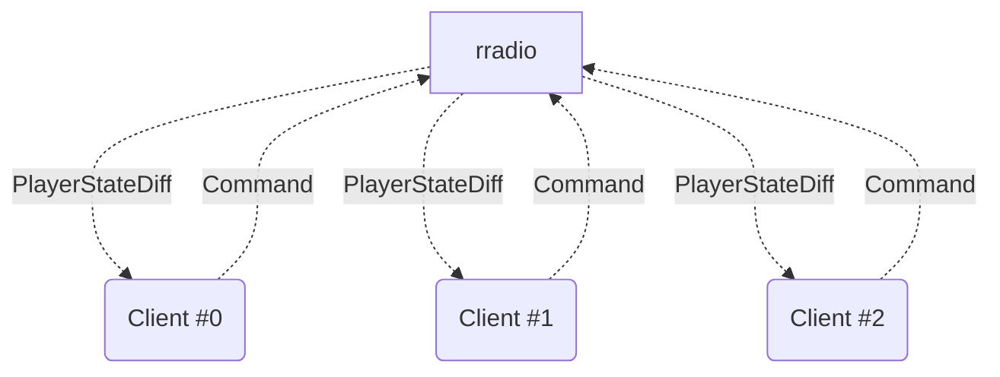
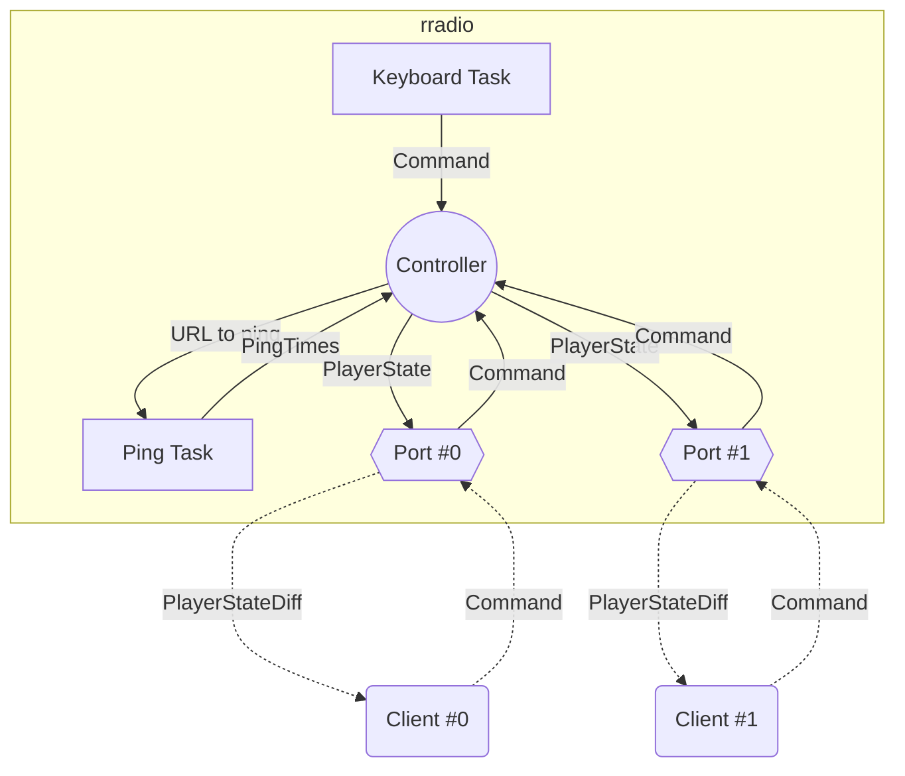

# Architecture

## Device Diagram

Rradio is designed to communicate with several other "devices", such as:
 - LCD displays
 - web browsers which run the web app

Devices other than rradio are generalised as being called "Clients", and communicate to rradio through "Ports".

## Task Diagram ##

Rradio itself consists of several asynchronous tasks, as described below:

### Messages

- Command (`rradio_messages::Command`)
  - Describes a command to rradio, such as playing a station, changing track, setting the volume, etc.
- PlayerState (`rradio::pipeline::controller::PlayerState`)
  - The entire current state of the rradio
  - Uses shared ownership of fixed values to optimise memory and CPU usage
- PlayerStateDiff (`rradio_messages::PlayerStateDiff`)
  - A record of the fields of PlayerState which have changed since the last PlayerStateDiff was sent
- PingTimes (`rradio_messages::PingTimes`)
  - The current ping times recorded by the Ping Task

### Components

#### Controller (`rradio::pipeline::controller::Controller`)

This is the central component of rradio, which contains gstreamer components for actually playing music, processes `Command`s and publishes `PlayerState`s.

#### Keyboard Task

This task processes keyboard input, recognises command sequences, and sends `Command`s to `Controller`

#### Ping Task

If enabled by the `ping` feature, when given track URLs by `Controller`, pings the gateway and remote server addresses, and sends `PingTimes` to `Controller`

#### Ports

To facilitate communication between rradio and connected clients, each connection has a Port to manage it.

A port keeps a local copy of a `PlayerState`, and when notified of a new `PlayerState`, creates a `PlayerStateDiff` by comparing it with its local copy, serializes the `PlayerStateDiff` using its specified encoding, and sends it over its communication medium (e.g. TCP).

A port also listens for incoming `Command`s serialized using its specified encoding, deserializes them, and forwards them to the `Controller`.

In this way, the `Controller` can be agnostic about the number and type of ports enabled and connected, decoupling the responsabilities of different parts of the design.

There are several different types of port, such as:

- [`postcard`](docs.rs/postcard/) over TCP
- [`postcard`](docs.rs/postcard/) over websockets
- JSON over HTTP over TCP (`Command`s only, no state updates)
